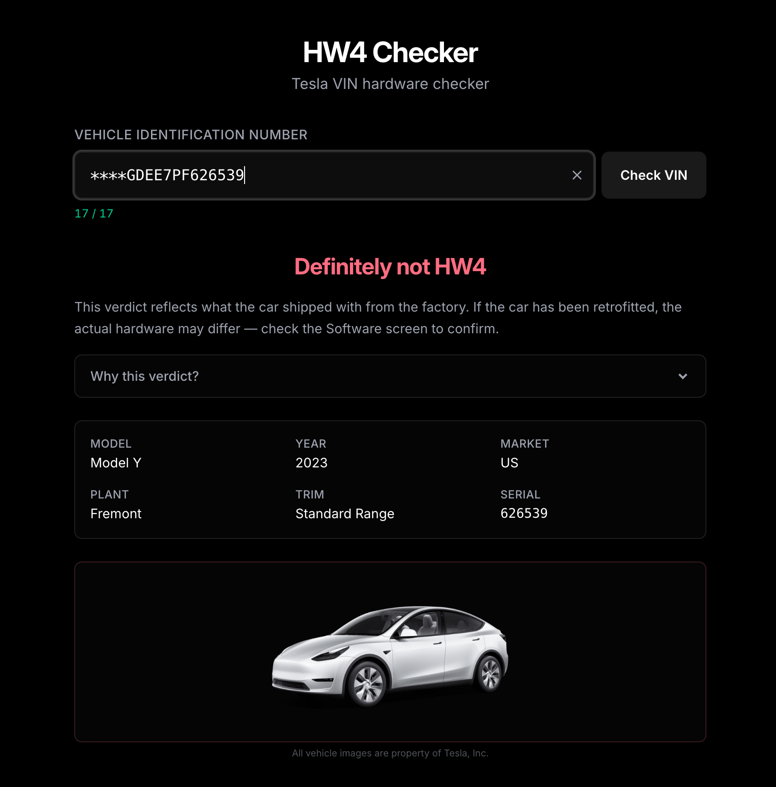

# HW4 Checker

**Live app:** https://manaux.github.io/HW4-checker/

---

Paste a Tesla VIN and instantly find out whether the car has Hardware 4 (HW4) — Tesla's latest Autopilot computer. No account, no upload, no waiting. The entire lookup runs in your browser using a community-sourced rule set, so it works just as well in airplane mode as it does on Wi-Fi.

The verdict comes back in one of three flavors: definitely yes, definitely no, or maybe (where the production records are ambiguous for that model/plant/year combo). Color-coded badge, decoded VIN fields, and a car silhouette so you know you're looking at the right model.

_Screenshot coming after first deploy_

---

## Privacy

Your VIN never leaves your device. There is no server, no analytics, no network request of any kind after the page loads. You can flip DevTools to "Offline" and everything still works — that's the whole point.

## Disclaimer

The underlying HW4 data is community-sourced and provided **as-is**. It is reasonably accurate for most model/year/plant combinations, but it is not authoritative. For a definitive answer, check the **Software** screen in your car's settings — Tesla shows the actual Autopilot computer installed.

## Tech

React 19 · TypeScript 6 (strict) · Vite 8 · Tailwind CSS v4 · Motion v12 · Vitest 4

## License

[MIT](LICENSE)
